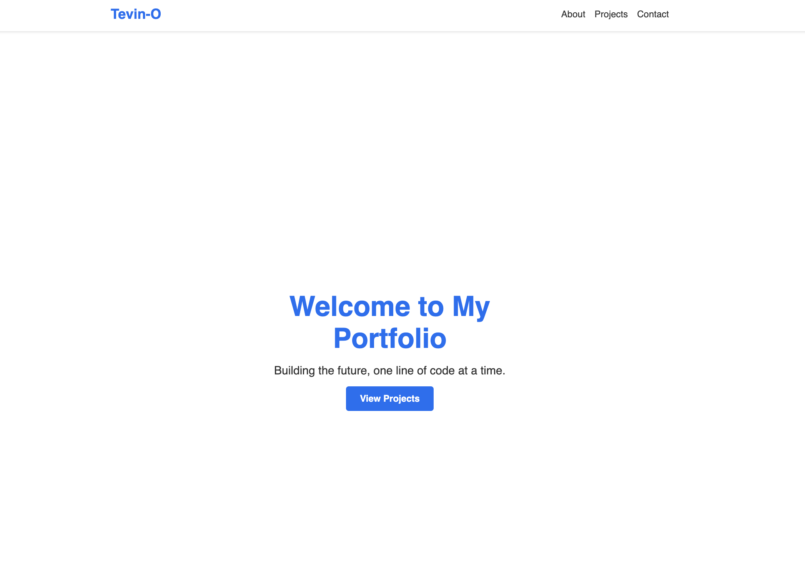
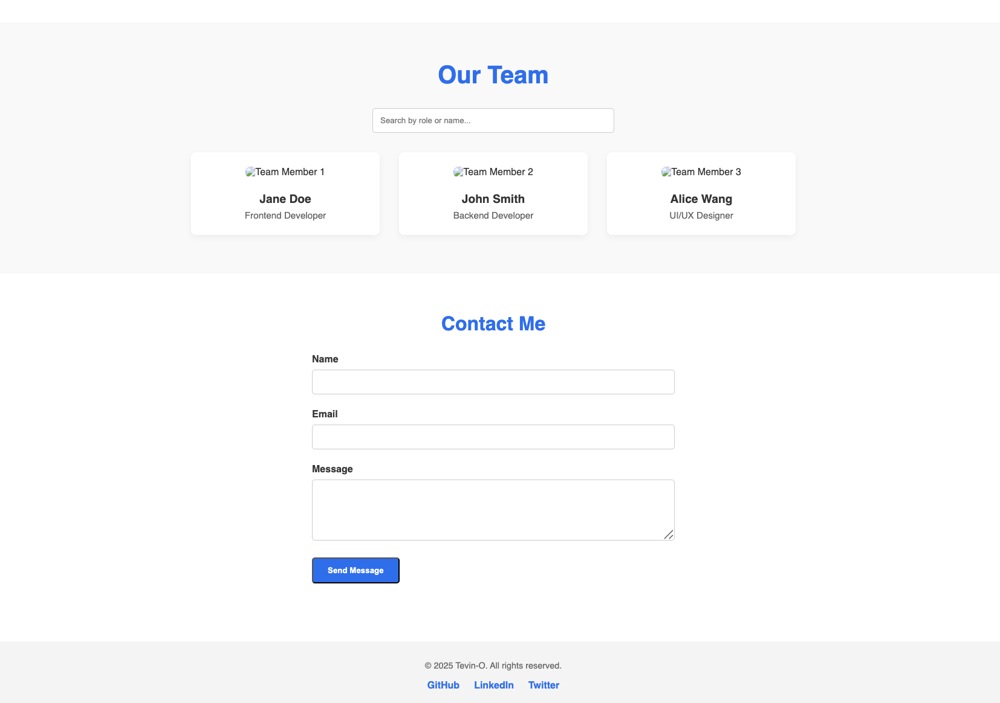
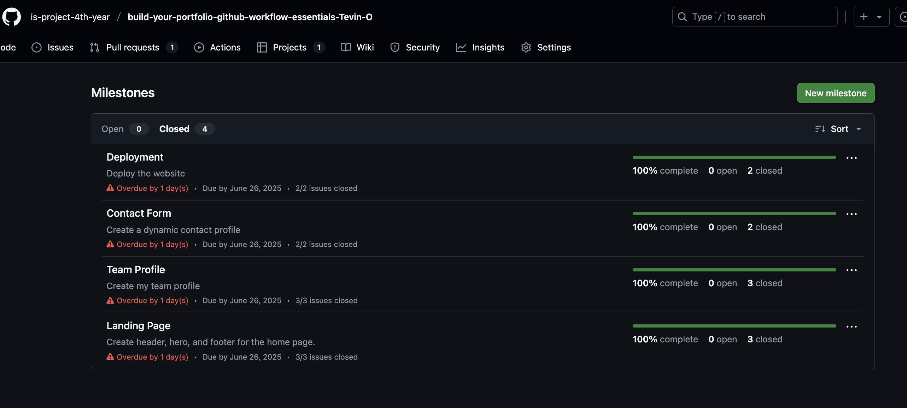
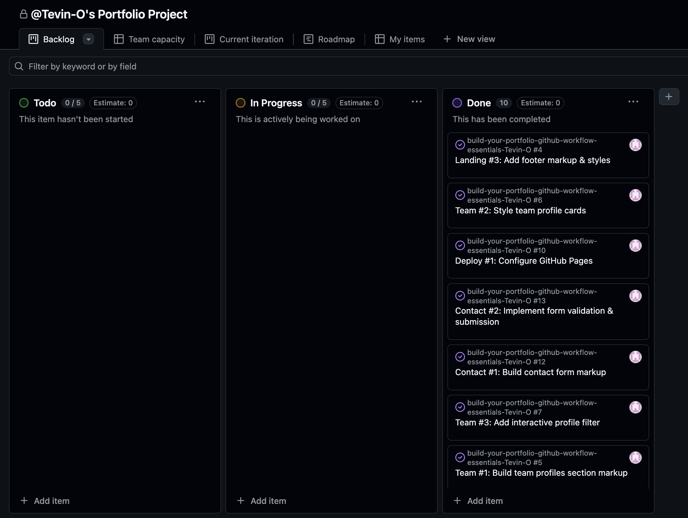
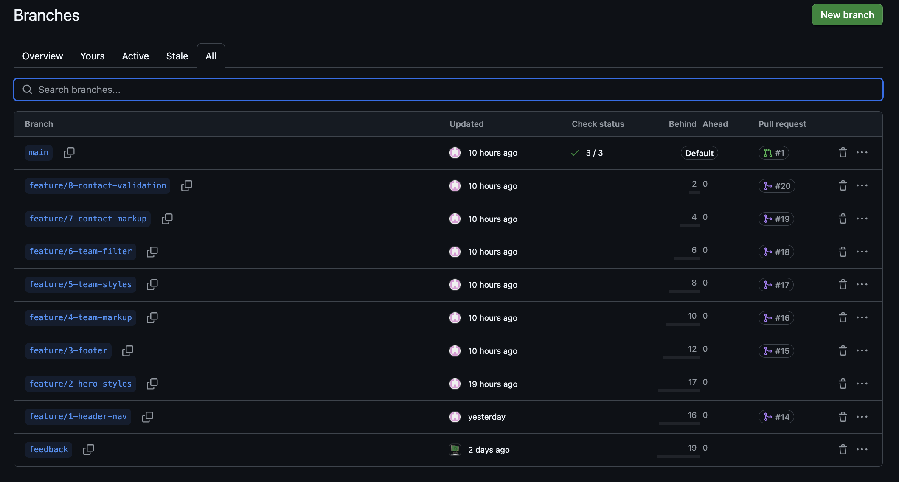
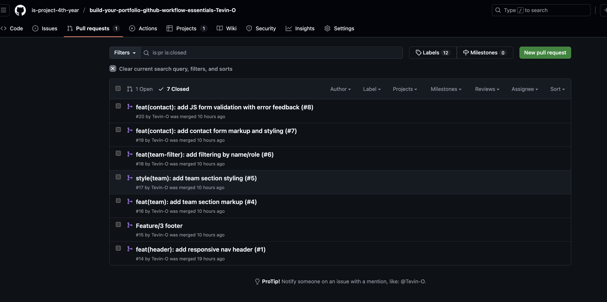
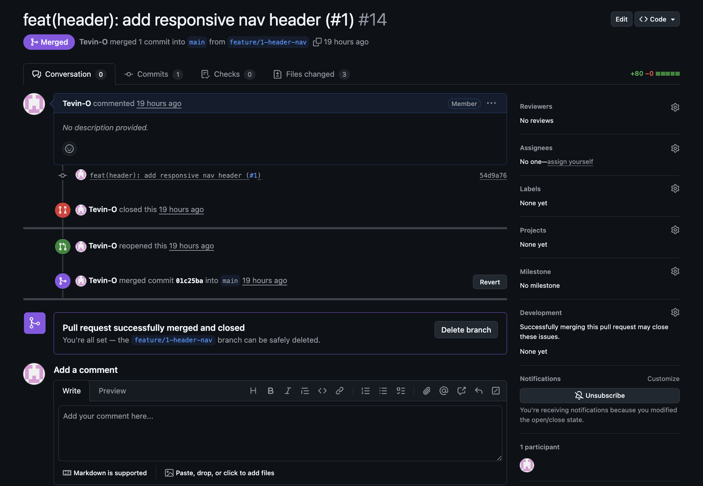

## 1. Student Details

- **Full Name**: Tevin Warui Omondi
- **Admission Number**: [150173]
- **GitHub Username**: Tevin-O
- **Email**: tevin.omondi@strathmore.edu

## 2. Deployed Portfolio Link

- **GitHub Pages URL**: https://is-project-4th-year.github.io/build-your-portfolio-github-workflow-essentials-Tevin-O/

### Website Screenshots

  
*This is the homepage of my portfolio, showing the hero section and navigation.*

  
*This shows the Projects section with the team profiles grid and filter in action.*

## 3. Learnings from the Git Crash Program

1. **Concept: GitHub Project Boards**  
   - **Expectation 👀**: Thought it was only for big teams.  
   - **Reality 😅**: A simple Kanban to track To Do → Done.  
   - **Impact 💡**: Kept me organized as I built each page of my portfolio.

2. **Concept: Feature Branching**  
   - **Expectation 👀**: Felt like extra work to branch for small changes.  
   - **Reality 😅**: Made it risk-free to experiment without breaking `main`.  
   - **Impact 💡**: I could style my navbar separately without fear of merge conflicts.

3. **Concept: Structured Commit Messages**  
   - **Expectation 👀**: Just type “fixed CSS” and move on.  
   - **Reality 😅**: The `<type>(<scope>): <description>` format clarifies history.  
   - **Impact 💡**: Reviewing my change log was a breeze when troubleshooting.

4. **Concept: Milestones & Issues**  
   - **Expectation 👀**: Felt like project management overkill.  
   - **Reality 😅**: Breaking “Landing page” into tasks (header, hero, footer) kept me focused.  
   - **Impact 💡**: No feature was forgotten, and I saw real progress on my board.

## 4. Screenshots of Key GitHub Features

### A. Milestones and Issues

*This shows the Milestones page with each Milestone’s progress bar and the list of related issues.*

---

### B. Project Board

*My Project Board with columns “To Do”, “In Progress”, and “Done”, showing how issues move through stages.*

---

### C. Branching

*Screenshot of all feature branches named using the `feature/<issue>-<desc>` convention.*

---

### D. Pull Requests

*An example of a merged Pull Request that references and closes its issue via `Closes #5`.*

---

### E. Merge Conflict Resolution

*This is the GitHub UI for resolving a merge conflict, where I chose which lines to keep before merging.*
